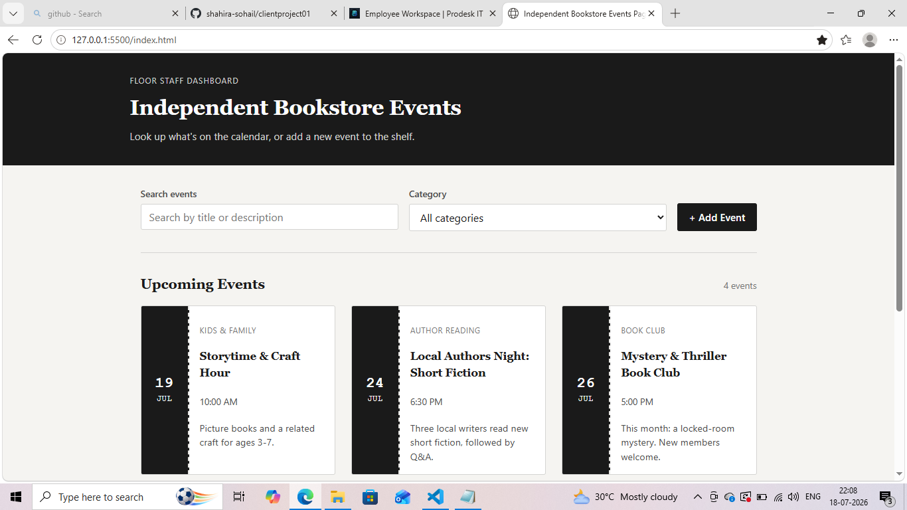
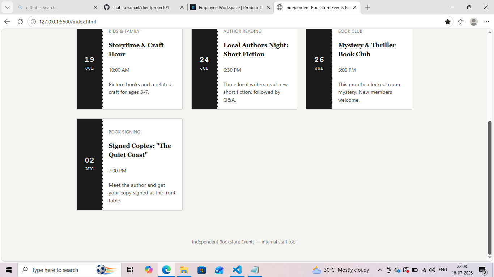
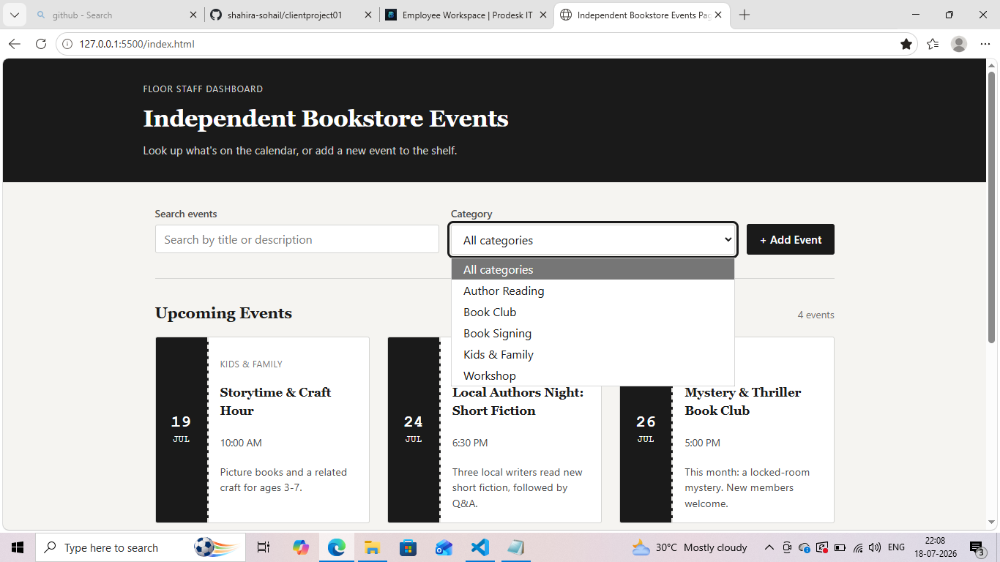
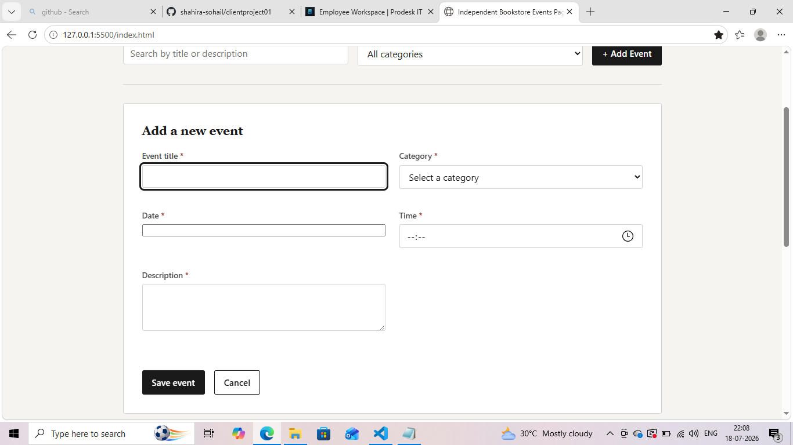
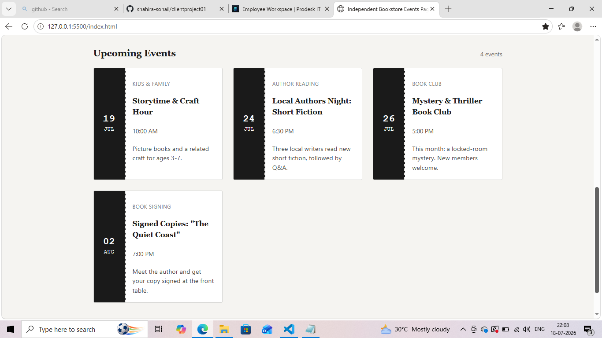

# Independent Bookstore Events Page

A responsive front-end application for browsing and managing bookstore events. This project was built using semantic HTML5, vanilla CSS, and JavaScript without any external frameworks or libraries.

## Overview

The application simulates an internal staff dashboard for an independent bookstore where employees can:

- View upcoming bookstore events
- Search events by title or description
- Filter events by category
- Add new events
- Handle loading, empty, and error states gracefully

The project follows accessibility, usability, and responsive design best practices.

## Features

- Responsive layout for desktop and mobile
- Semantic HTML5 structure
- Vanilla JavaScript (no frameworks)
- Event search functionality
- Category filtering
- Add new events form
- Client-side form validation
- Input sanitization against basic XSS attacks
- Loading indicator for asynchronous operations
- Empty state handling
- Error state with retry option
- Simulated analytics logging
- Local Storage persistence
- Keyboard accessible interface
- ARIA labels and live regions for accessibility

## Technologies Used

- HTML5
- CSS3
- JavaScript (ES6)
- Local Storage API

## Accessibility

The application was built with accessibility in mind by including:

- Semantic HTML elements
- Proper form labels
- ARIA labels and live regions
- Keyboard navigation support
- Visible focus indicators
- Accessible validation messages

## Edge Case Handling

The application handles several common edge cases:

### Empty State

Displays a friendly "No events found" message when no matching events exist.

### Slow Connections

Shows a loading spinner while asynchronous operations are in progress.

### Network Failure

Displays an error message with a Retry button if loading fails.

### Invalid Form Submission

Prevents submission when required fields are missing and highlights invalid fields.

### Input Security

User-entered text is sanitized before being stored to help prevent basic XSS attacks.


## Telemetry Simulation

Primary user actions log a simulated analytics message to the browser console.

Example:

```javascript
[Analytics] User interacted with Independent Bookstore Events Page
```

---

## Local Storage

Newly created events are automatically saved using the browser's Local Storage API.

This allows events to remain available after refreshing the page without requiring a backend database.

##Live Url
[https://bookstore-event-module.vercel.app](https://bookstore-event-module.vercel.app/)

##Screenahots






##Author
Shahira sohail
